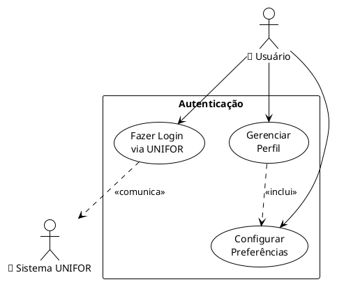

# 👁️ Como Visualizar os Diagramas de Caso de Uso

## 🚀 **Método Mais Rápido (Recomendado)**

### **1. PlantUML Online** ⚡
1. **Acesse**: http://www.plantuml.com/plantuml/uml/
2. **Cole** qualquer código PlantUML do arquivo `DIAGRAMAS_UML_VISUAL.md`
3. **Clique** em "Submit"
4. **Visualize** o diagrama instantaneamente
5. **Baixe** como PNG clicando com botão direito

**Exemplo prático:**
```
1. Copie este código:
@startuml
actor "👤 Usuário" as User
usecase "Fazer Login" as Login
User --> Login
@enduml

2. Cole no site
3. Veja o resultado visual!
```

---

## 🖥️ **Método para VS Code** (Se você usa VS Code)

### **Instalação:**
1. Abra VS Code
2. Vá em Extensions (`Ctrl+Shift+X`)
3. Procure por "PlantUML"
4. Instale a extensão oficial

### **Uso:**
1. Crie um arquivo `.puml` (ex: `diagrama.puml`)
2. Cole o código PlantUML
3. Pressione `Alt+D` para preview
4. Ou use `Ctrl+Shift+P` → "PlantUML: Preview Current Diagram"

---

## 🌐 **Método GitHub/GitLab** (Automático)

### **GitHub:**
- Os diagramas Mermaid nos arquivos `.md` são renderizados automaticamente
- Basta abrir qualquer arquivo `.md` no GitHub
- Exemplo: `DOCUMENTACAO_SISTEMA.md` já tem diagramas Mermaid

### **GitLab:**
- Suporte nativo para Mermaid
- Visualização automática em arquivos Markdown

---

## 🎨 **Método Draw.io** (Visual/Manual)

### **Para criar diagramas similares à sua imagem:**

1. **Acesse**: https://app.diagrams.net/
2. **Escolha**: "Create New Diagram"
3. **Selecione**: "UML" → "Use Case Diagram"
4. **Elementos disponíveis:**
   - 👤 **Actor** (pessoa/sistema)
   - ⭕ **Use Case** (casos de uso)
   - ➡️ **Association** (linhas sólidas)
   - ➡️ **Include/Extend** (linhas tracejadas)

### **Passo a passo para recriar:**
1. **Arraste** um "Actor" da paleta
2. **Renomeie** para "Usuário", "ProfAi", etc.
3. **Arraste** "Use Cases" (círculos/elipses)
4. **Conecte** com linhas
5. **Adicione** labels nas linhas (<<include>>, <<extend>>)

---

## 📱 **Apps Mobile para Visualização**

### **Android:**
- **PlantUML Viewer**: Visualiza códigos PlantUML
- **Draw.io**: App oficial para Android
- **Lucidchart**: App profissional

### **iOS:**
- **PlantUML Viewer**: Disponível na App Store
- **Draw.io**: App oficial para iOS
- **OmniGraffle**: Ferramenta profissional (paga)

---

## 🔧 **Ferramentas Desktop Gratuitas**

### **1. Draw.io Desktop**
- **Download**: https://github.com/jgraph/drawio-desktop/releases
- **Vantagem**: Funciona offline
- **Formatos**: PNG, SVG, PDF, XML

### **2. PlantUML com Java**
- **Download**: http://plantuml.com/download
- **Comando**: `java -jar plantuml.jar diagrama.puml`
- **Gera**: PNG, SVG, PDF automaticamente

### **3. Umbrello (Linux/KDE)**
- **Instalação**: `sudo apt install umbrello`
- **Foco**: Diagramas UML profissionais
- **Exportação**: Múltiplos formatos

---

## 🎯 **Exemplo Prático - Passo a Passo**

### **Vamos criar o diagrama "Gestão de Usuários":**

#### **Passo 1: Escolha a ferramenta**
- Recomendo: **PlantUML Online** (mais rápido)

#### **Passo 2: Use este código**


#### **Passo 3: Visualize**
1. Cole no PlantUML Online
2. Veja o resultado
3. Baixe como PNG

#### **Resultado esperado:**
- Usuário conectado aos casos de uso
- Sistema UNIFOR como ator secundário
- Relacionamentos include/extend
- Visual limpo e profissional

---

## 🎨 **Personalizações Visuais**

### **Cores Personalizadas:**
```plantuml
skinparam actor {
  BackgroundColor lightblue
  BorderColor darkblue
}
skinparam usecase {
  BackgroundColor lightyellow
  BorderColor orange
}
```

### **Ícones e Emojis:**
```plantuml
actor "👤\nEstudante" as Student
actor "🤖\nProfAi" as AI
usecase "📝 Editar Texto" as Edit
usecase "🔍 Analisar" as Analyze
```

### **Layout Personalizado:**
```plantuml
left to right direction
' ou
top to bottom direction
```

---

## 📊 **Comparação de Ferramentas**

| Ferramenta | Facilidade | Qualidade | Velocidade | Custo |
|------------|------------|-----------|------------|-------|
| **PlantUML Online** | ⭐⭐⭐⭐⭐ | ⭐⭐⭐⭐ | ⭐⭐⭐⭐⭐ | 🆓 |
| **Draw.io** | ⭐⭐⭐⭐ | ⭐⭐⭐⭐⭐ | ⭐⭐⭐ | 🆓 |
| **VS Code + PlantUML** | ⭐⭐⭐ | ⭐⭐⭐⭐ | ⭐⭐⭐⭐ | 🆓 |
| **Lucidchart** | ⭐⭐⭐⭐⭐ | ⭐⭐⭐⭐⭐ | ⭐⭐⭐⭐ | 💰 |
| **Visio** | ⭐⭐⭐ | ⭐⭐⭐⭐⭐ | ⭐⭐ | 💰💰 |

---

## 🚨 **Solução de Problemas Comuns**

### **Problema: "Diagrama não aparece"**
**Solução:**
- Verifique a sintaxe do código
- Certifique-se que começou com `@startuml`
- Terminou com `@enduml`

### **Problema: "Caracteres especiais não aparecem"**
**Solução:**
- Use UTF-8 encoding
- Teste com emojis simples primeiro
- Alguns viewers não suportam todos os emojis

### **Problema: "Layout bagunçado"**
**Solução:**
- Use `left to right direction`
- Agrupe elementos em `rectangle`
- Ajuste com `skinparam`

---

## 📞 **Precisa de Ajuda?**

### **Recursos Online:**
- **PlantUML Guide**: http://plantuml.com/guide
- **Draw.io Tutorials**: https://www.diagrams.net/blog/tutorials
- **UML Best Practices**: https://www.uml-diagrams.org/

### **Comunidades:**
- **Stack Overflow**: Tag "plantuml"
- **Reddit**: r/UML, r/PlantUML
- **GitHub**: Issues nos repositórios oficiais

---

## 🎯 **Próximos Passos Recomendados**

1. **Teste** o PlantUML Online com um diagrama simples
2. **Escolha** sua ferramenta preferida
3. **Recrie** os diagramas da documentação
4. **Personalize** cores e estilos
5. **Exporte** em alta qualidade
6. **Integre** na sua documentação final

**Tempo estimado**: 30 minutos para dominar o básico! 🚀

---

*Guia de Visualização criado em: ${new Date().toLocaleDateString('pt-BR')}*
*Testado com: PlantUML, Draw.io, VS Code, GitHub*
