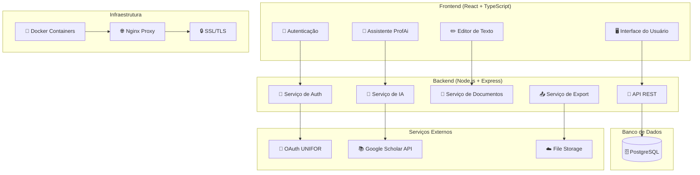
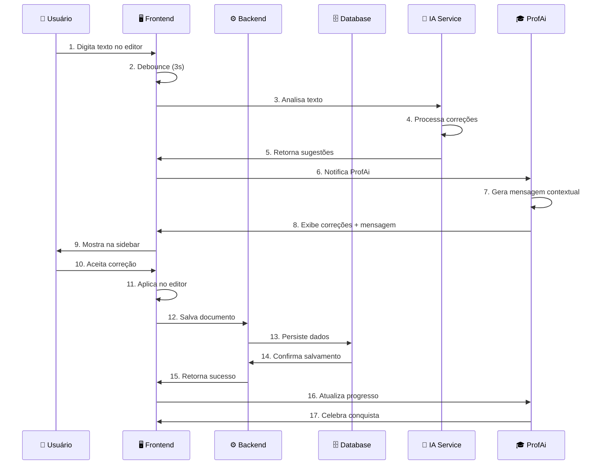
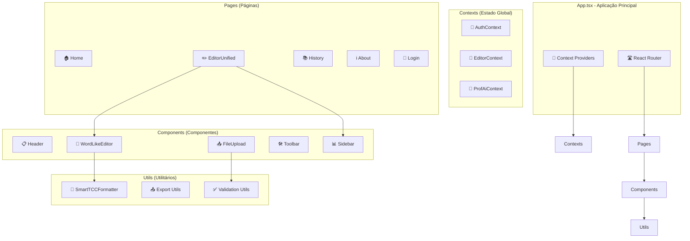
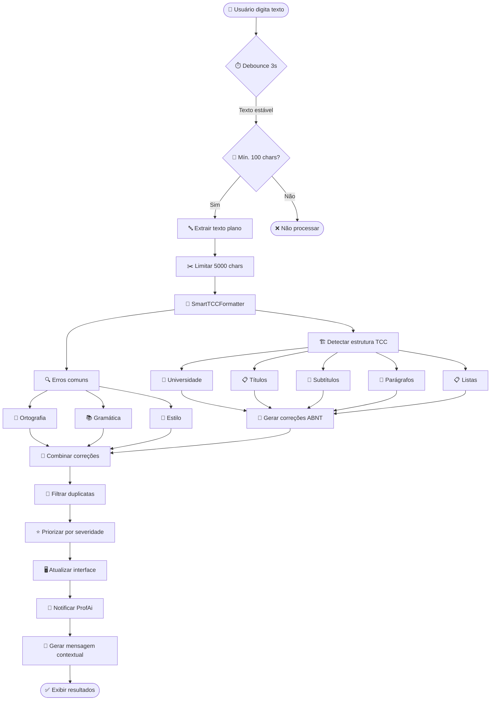
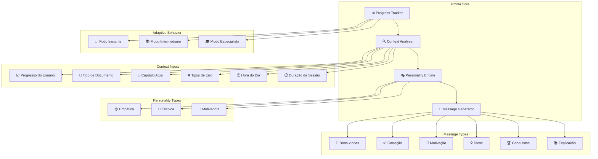
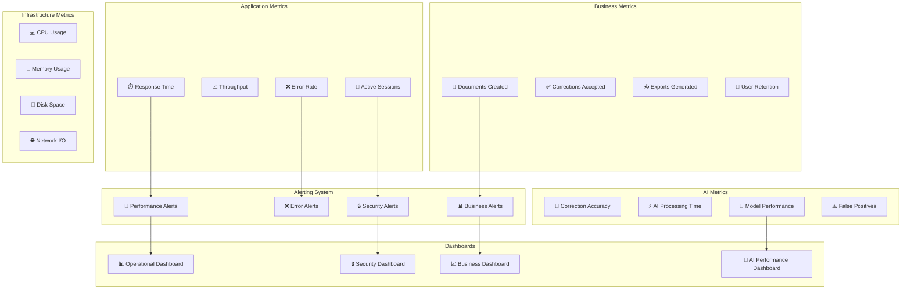
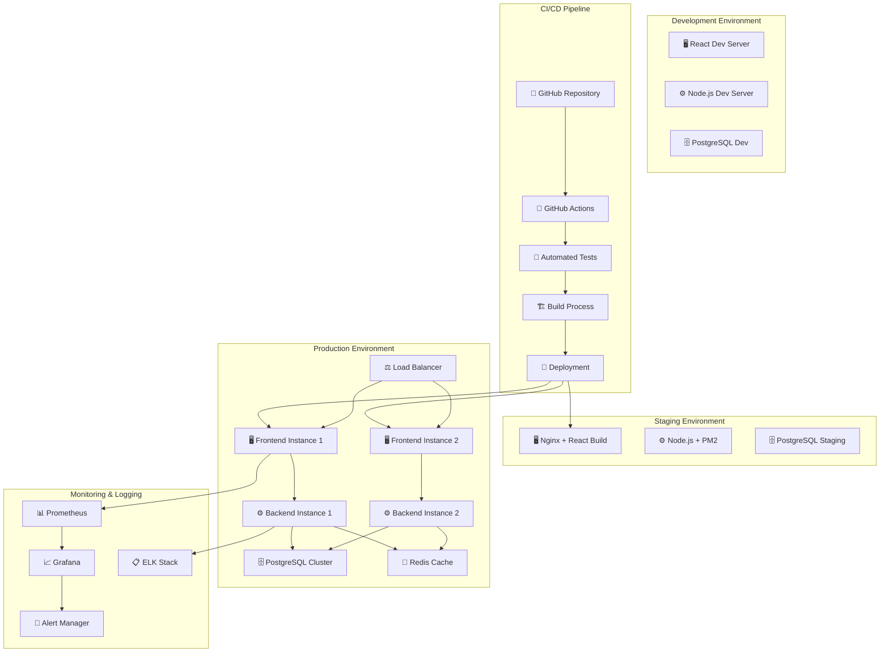

# 🏗️ Diagramas de Arquitetura - ProfAi TCC Editor

## 📐 Arquitetura Geral do Sistema



---

## 🔄 Fluxo de Dados Principal



---

## 🧩 Arquitetura de Componentes Frontend



---

## 🗄️ Modelo de Dados (Banco PostgreSQL)

```mermaid
erDiagram
    USERS {
        uuid id PK
        string name
        string email UK
        string course
        string university
        string avatar_url
        boolean is_unifor_user
        timestamp last_login
        jsonb preferences
        timestamp created_at
        timestamp updated_at
    }
    
    DOCUMENTS {
        uuid id PK
        uuid user_id FK
        string title
        text content
        text original_content
        integer progress
        integer word_count
        integer chapter_count
        timestamp created_at
        timestamp updated_at
    }
    
    CORRECTIONS {
        uuid id PK
        uuid document_id FK
        string type
        string severity
        text message
        text original_text
        text suggested_text
        jsonb position
        boolean accepted
        boolean rejected
        boolean applied
        text explanation
        string chapter
        timestamp created_at
    }
    
    VERSIONS {
        uuid id PK
        uuid document_id FK
        text content
        jsonb changes
        integer word_count
        text description
        timestamp created_at
    }
    
    ACHIEVEMENTS {
        uuid id PK
        uuid user_id FK
        string achievement_type
        string title
        text description
        string icon
        integer progress
        integer max_progress
        timestamp unlocked_at
        timestamp created_at
    }
    
    PROFAI_MESSAGES {
        uuid id PK
        uuid user_id FK
        uuid document_id FK
        string type
        text content
        string priority
        string category
        jsonb position
        jsonb action
        boolean read
        timestamp created_at
    }
    
    FILE_UPLOADS {
        uuid id PK
        uuid user_id FK
        uuid document_id FK
        string filename
        string file_type
        integer file_size
        string status
        text extracted_text
        jsonb metadata
        timestamp uploaded_at
    }
    
    CITATIONS {
        uuid id PK
        uuid document_id FK
        text citation_text
        string author
        integer year
        string title
        string source
        string type
        text abnt_format
        jsonb position
        timestamp created_at
    }
    
    USERS ||--o{ DOCUMENTS : "creates"
    USERS ||--o{ ACHIEVEMENTS : "earns"
    USERS ||--o{ PROFAI_MESSAGES : "receives"
    USERS ||--o{ FILE_UPLOADS : "uploads"
    
    DOCUMENTS ||--o{ CORRECTIONS : "has"
    DOCUMENTS ||--o{ VERSIONS : "has"
    DOCUMENTS ||--o{ CITATIONS : "contains"
    DOCUMENTS ||--o{ FILE_UPLOADS : "from"
    DOCUMENTS ||--o{ PROFAI_MESSAGES : "about"
```



---

## 🔌 Arquitetura de APIs

```mermaid
graph TB
    subgraph "API Gateway"
        Gateway[🚪 API Gateway]
        Auth_Middleware[🔐 Auth Middleware]
        Rate_Limiter[⏱️ Rate Limiter]
        CORS[🌐 CORS Handler]
    end
    
    subgraph "Authentication Service"
        OAuth[🔑 OAuth Handler]
        JWT[🎫 JWT Service]
        Session[📝 Session Manager]
    end
    
    subgraph "Document Service"
        CRUD[📄 Document CRUD]
        Upload[📤 File Upload]
        Export[📥 Export Service]
        Version[🔄 Version Control]
    end
    
    subgraph "AI Service"
        TextAnalysis[🔍 Text Analysis]
        Corrections[✅ Correction Engine]
        ABNTFormatter[📐 ABNT Formatter]
        SmartSuggestions[💡 Smart Suggestions]
    end
    
    subgraph "ProfAi Service"
        MessageGenerator[💬 Message Generator]
        PersonalityEngine[🎭 Personality Engine]
        ProgressTracker[📊 Progress Tracker]
        AchievementSystem[🏆 Achievement System]
    end
    
    subgraph "External APIs"
        UNIFOR_OAuth[🏫 UNIFOR OAuth]
        GoogleScholar[📚 Google Scholar]
        FileStorage[☁️ File Storage]
    end
    
    Gateway --> Auth_Middleware
    Auth_Middleware --> Rate_Limiter
    Rate_Limiter --> CORS
    
    CORS --> Authentication Service
    CORS --> Document Service
    CORS --> AI Service
    CORS --> ProfAi Service
    
    OAuth --> UNIFOR_OAuth
    Upload --> FileStorage
    SmartSuggestions --> GoogleScholar
```

---

## 🔄 Pipeline de Processamento de Texto



---

## 🎨 Fluxo de Formatação ABNT

```mermaid
flowchart TD
    UserClick([👤 Usuário clica "ABNT"]) --> GetText[📄 Obter texto do editor]
    GetText --> ClearFormat[🧹 Limpar formatação existente]
    ClearFormat --> ApplyBase[📝 Aplicar base: Times 12pt]
    
    ApplyBase --> SplitLines[✂️ Dividir em linhas]
    SplitLines --> ProcessLine{🔄 Para cada linha}
    
    ProcessLine --> DetectType{🔍 Detectar tipo}
    
    DetectType -->|UNIVERSIDADE FEDERAL| University[🏫 Formato Capa]
    DetectType -->|RESUMO, INTRODUÇÃO| MainTitle[📋 Título Principal]
    DetectType -->|1 INTRODUÇÃO| NumberedTitle[🔢 Título Numerado]
    DetectType -->|1.1 Objetivos| Subtitle[📝 Subtítulo]
    DetectType -->|Nome Próprio| Author[👤 Nome Autor]
    DetectType -->|TÍTULO MAIÚSCULO| WorkTitle[📚 Título Trabalho]
    DetectType -->|• Lista| List[📋 Lista]
    DetectType -->|Texto normal| Paragraph[📄 Parágrafo]
    
    University --> Format1[📐 14pt, negrito, centro]
    MainTitle --> Format2[📐 14pt, negrito, centro, H1]
    NumberedTitle --> Format3[📐 14pt, negrito, esquerda, H1]
    Subtitle --> Format4[📐 12pt, negrito, esquerda, H2]
    Author --> Format5[📐 12pt, negrito, centro]
    WorkTitle --> Format6[📐 16pt, negrito, centro]
    List --> Format7[📐 Lista com marcadores]
    Paragraph --> Format8[📐 12pt, justificado, recuo]
    
    Format1 --> NextLine{➡️ Próxima linha?}
    Format2 --> NextLine
    Format3 --> NextLine
    Format4 --> NextLine
    Format5 --> NextLine
    Format6 --> NextLine
    Format7 --> NextLine
    Format8 --> NextLine
    
    NextLine -->|Sim| ProcessLine
    NextLine -->|Não| ApplySpacing[📏 Aplicar espaçamento 1.6]
    
    ApplySpacing --> UpdateEditor[🔄 Atualizar editor]
    UpdateEditor --> RunAnalysis[🧠 Executar análise IA]
    RunAnalysis --> ShowSuccess[✅ Mostrar sucesso]
    ShowSuccess --> End([🎉 Formatação concluída])
```

---

## 🤖 Arquitetura da ProfAi



---

## 🔒 Arquitetura de Segurança

```mermaid
graph TB
    subgraph "Frontend Security"
        CSP[🛡️ Content Security Policy]
        XSS[🚫 XSS Protection]
        InputValidation[✅ Input Validation]
        TokenStorage[🔐 Secure Token Storage]
    end
    
    subgraph "API Security"
        HTTPS[🔒 HTTPS/TLS]
        CORS[🌐 CORS Policy]
        RateLimit[⏱️ Rate Limiting]
        AuthMiddleware[🔑 Auth Middleware]
    end
    
    subgraph "Authentication"
        OAuth2[🎫 OAuth2/UNIFOR]
        JWT[🔑 JWT Tokens]
        RefreshToken[🔄 Refresh Tokens]
        SessionMgmt[📝 Session Management]
    end
    
    subgraph "Data Protection"
        Encryption[🔐 Data Encryption]
        Sanitization[🧹 Data Sanitization]
        Validation[✅ Input Validation]
        Backup[💾 Secure Backup]
    end
    
    subgraph "Infrastructure Security"
        Firewall[🔥 Firewall]
        VPN[🌐 VPN Access]
        Monitoring[👁️ Security Monitoring]
        Logging[📋 Audit Logging]
    end
    
    subgraph "Compliance"
        LGPD[📋 LGPD Compliance]
        DataRetention[🗄️ Data Retention]
        UserConsent[✅ User Consent]
        DataPortability[📤 Data Portability]
    end
    
    CSP --> HTTPS
    XSS --> CORS
    InputValidation --> RateLimit
    TokenStorage --> AuthMiddleware
    
    OAuth2 --> JWT
    JWT --> RefreshToken
    RefreshToken --> SessionMgmt
    
    Encryption --> Sanitization
    Sanitization --> Validation
    Validation --> Backup
    
    Firewall --> VPN
    VPN --> Monitoring
    Monitoring --> Logging
    
    LGPD --> DataRetention
    DataRetention --> UserConsent
    UserConsent --> DataPortability
```



---

## 📊 Monitoramento e Observabilidade



---

## 🚀 Deployment Architecture



---

*Diagramas de Arquitetura gerados em: ${new Date().toLocaleDateString('pt-BR')}*
*Sistema: ProfAi TCC Editor v1.0.0*
