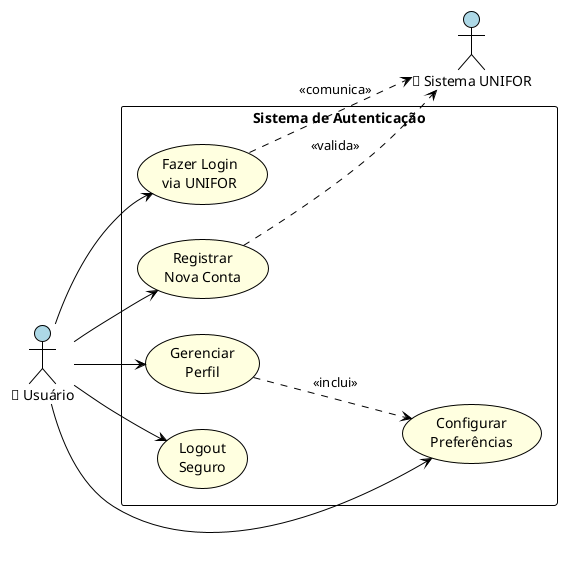
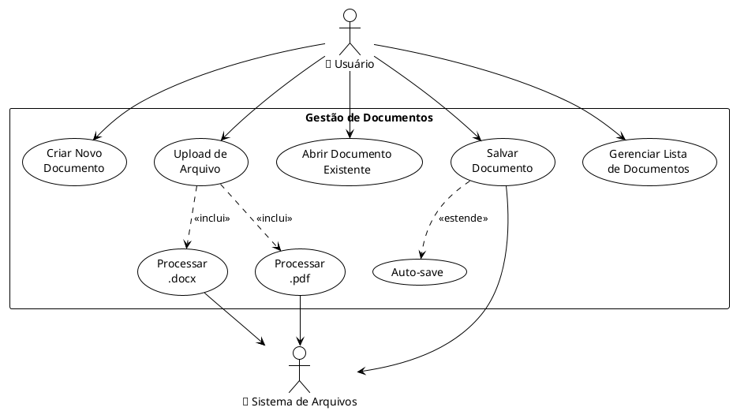
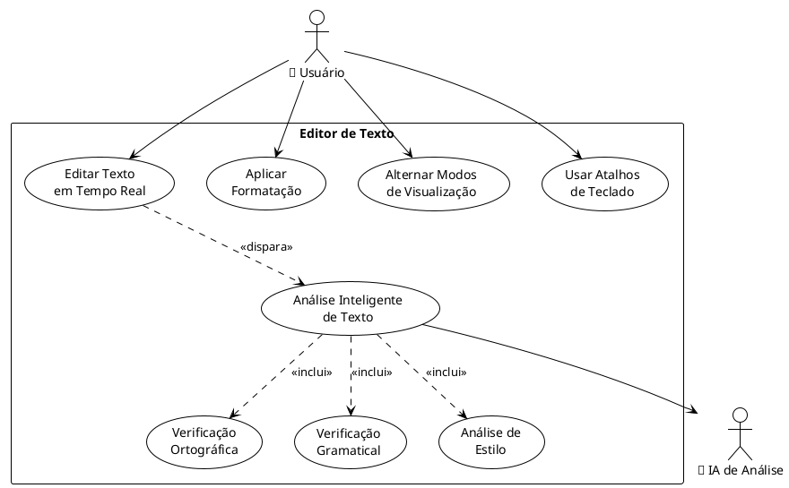
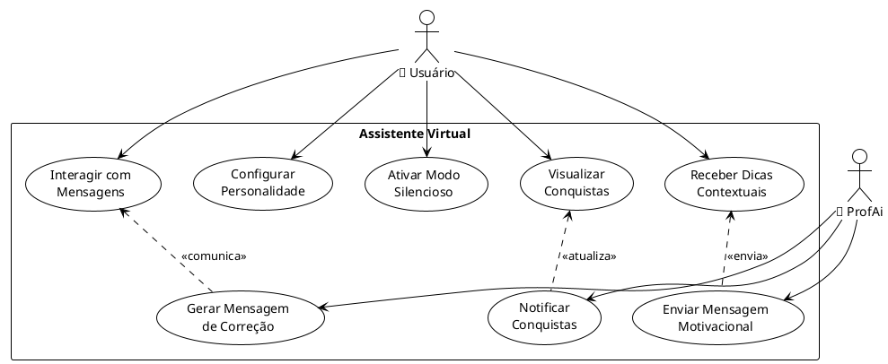
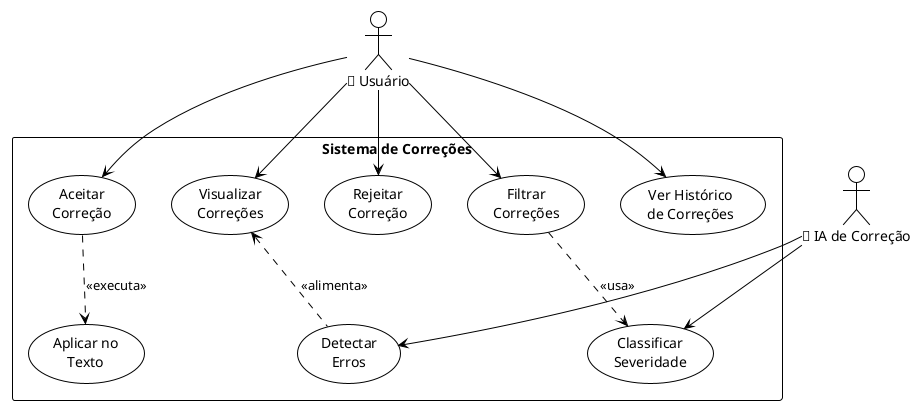
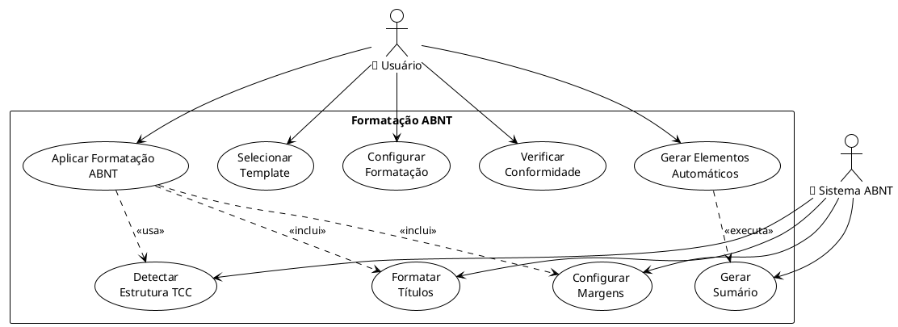
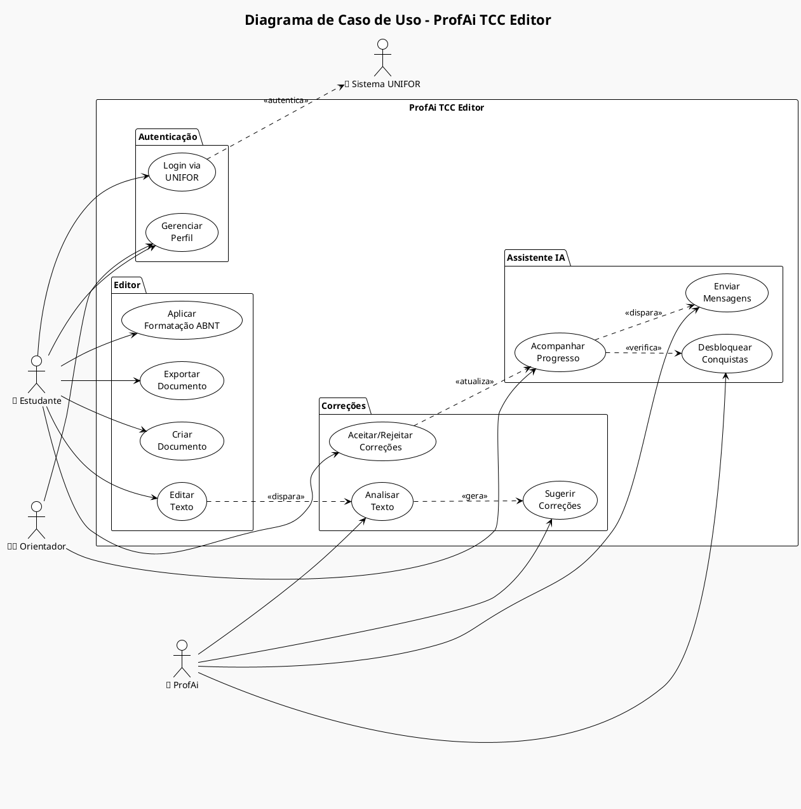
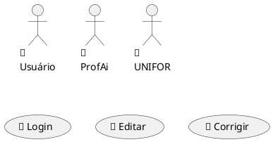

# 🎨 Diagramas UML Visuais - ProfAi TCC Editor

## 📋 Como Visualizar os Diagramas de Caso de Uso

### 🔧 **Opções para Visualização dos Diagramas**

#### 1. 🌐 **Mermaid Live Editor** (Recomendado)
- **URL**: https://mermaid.live/
- **Como usar**:
  1. Acesse o site
  2. Cole o código Mermaid dos diagramas
  3. Visualize em tempo real
  4. Exporte como PNG/SVG

#### 2. 📝 **GitHub/GitLab** (Automático)
- Os diagramas Mermaid são renderizados automaticamente
- Basta visualizar os arquivos `.md` no repositório
- Suporte nativo para Mermaid

#### 3. 🔧 **VS Code Extensions**
- **Mermaid Preview**: Visualização em tempo real
- **Markdown Preview Enhanced**: Suporte completo
- **PlantUML**: Para diagramas UML tradicionais

#### 4. 🖥️ **Ferramentas Desktop**
- **Draw.io** (Gratuito): https://app.diagrams.net/
- **Lucidchart**: Ferramenta profissional
- **PlantUML**: Geração automática de diagramas

---

## 🎯 **Diagramas de Caso de Uso no Estilo Visual Tradicional**

### 1. 🔐 **Gestão de Usuários e Autenticação**



### 2. 📝 **Gestão de Documentos**



### 3. ✏️ **Editor de Texto Inteligente**



### 4. 🤖 **Assistente Virtual ProfAi**



### 5. 🔍 **Sistema de Correções**



### 6. 📐 **Formatação ABNT Automática**



---

## 🛠️ **Como Gerar os Diagramas Visuais**

### **Método 1: PlantUML Online**
1. Acesse: http://www.plantuml.com/plantuml/uml/
2. Cole o código PlantUML acima
3. Clique em "Submit"
4. Baixe a imagem gerada

### **Método 2: VS Code com PlantUML**
1. Instale a extensão "PlantUML"
2. Crie um arquivo `.puml`
3. Cole o código
4. Use `Ctrl+Shift+P` → "PlantUML: Preview Current Diagram"

### **Método 3: Draw.io (Manual)**
1. Acesse: https://app.diagrams.net/
2. Escolha "UML" → "Use Case Diagram"
3. Recrie os diagramas manualmente
4. Exporte como PNG/SVG

### **Método 4: Lucidchart (Profissional)**
1. Acesse: https://www.lucidchart.com/
2. Crie novo diagrama UML
3. Use templates de caso de uso
4. Colabore em tempo real

---

## 📊 **Exemplo de Diagrama Completo - Sistema ProfAi**



---

## 🎨 **Personalização Visual**

### **Cores e Estilos Personalizados**
```plantuml
@startuml
!theme plain

' Definir cores personalizadas
skinparam backgroundColor #f8f9fa
skinparam actor {
  BackgroundColor #e3f2fd
  BorderColor #1976d2
  FontColor #1976d2
}
skinparam usecase {
  BackgroundColor #fff3e0
  BorderColor #f57c00
  FontColor #e65100
}
skinparam rectangle {
  BackgroundColor #f3e5f5
  BorderColor #7b1fa2
}

' Seu diagrama aqui...
@enduml
```

### **Ícones e Emojis**


---

## 📱 **Ferramentas Recomendadas por Plataforma**

### **Windows**
- ✅ **PlantUML** + VS Code
- ✅ **Draw.io Desktop**
- ✅ **Lucidchart**
- ✅ **Visio** (Microsoft)

### **Mac**
- ✅ **PlantUML** + VS Code
- ✅ **OmniGraffle**
- ✅ **Draw.io Desktop**
- ✅ **Lucidchart**

### **Linux**
- ✅ **PlantUML** + VS Code
- ✅ **Umbrello** (KDE)
- ✅ **Draw.io Desktop**
- ✅ **Dia**

### **Online (Qualquer Plataforma)**
- ✅ **PlantUML Online**: http://www.plantuml.com/plantuml/
- ✅ **Draw.io**: https://app.diagrams.net/
- ✅ **Lucidchart**: https://www.lucidchart.com/
- ✅ **Mermaid Live**: https://mermaid.live/

---

*Diagramas UML Visuais gerados em: ${new Date().toLocaleDateString('pt-BR')}*
*Sistema: ProfAi TCC Editor v1.0.0*
*Padrão: UML 2.5 / PlantUML*
