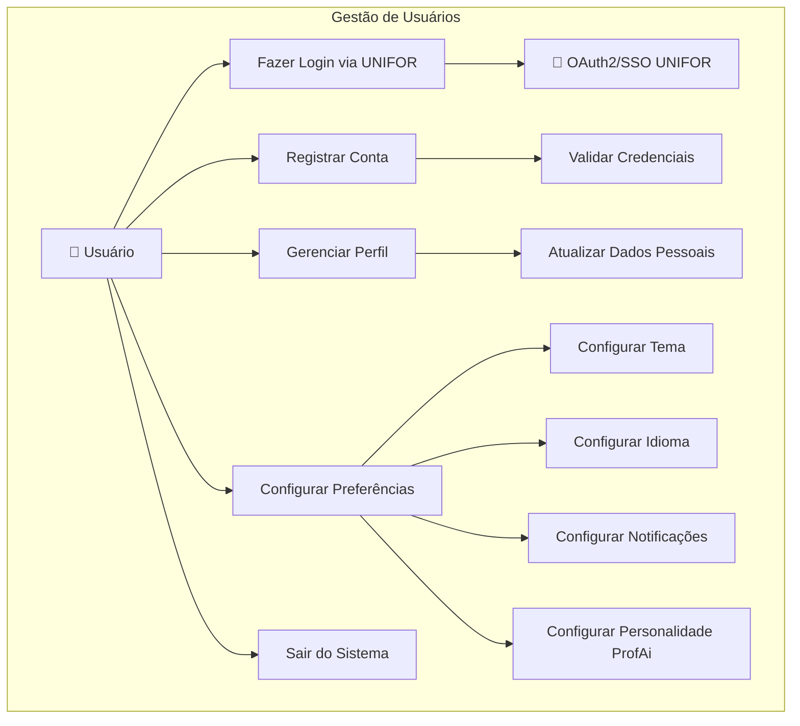
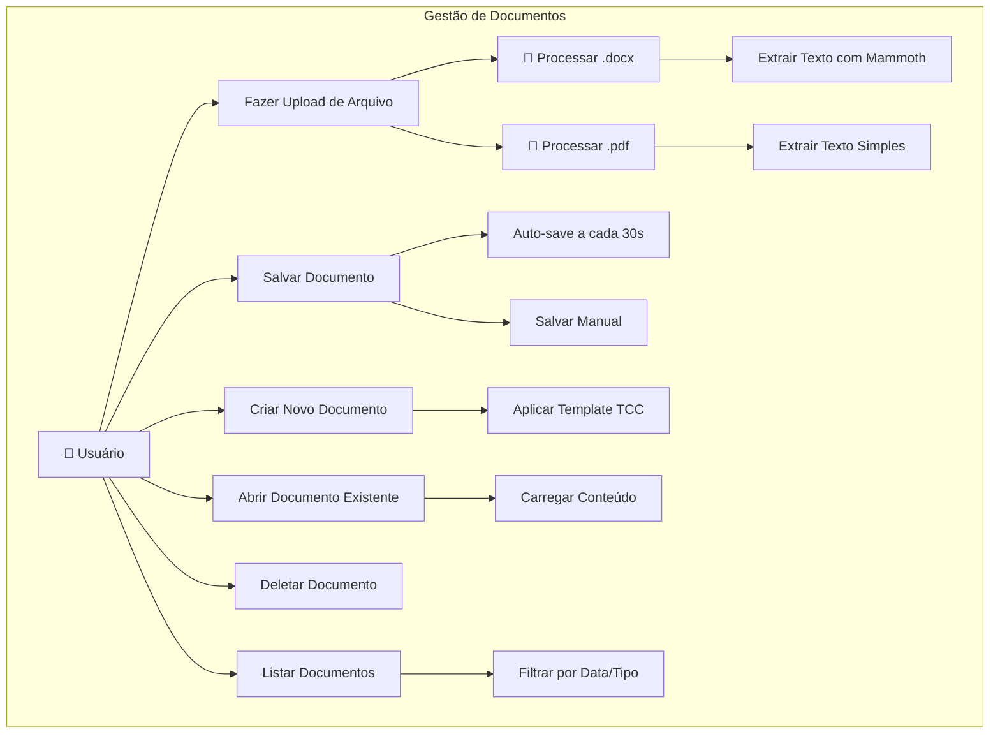
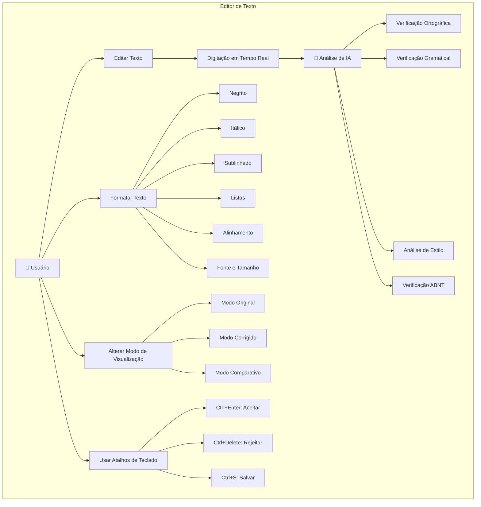
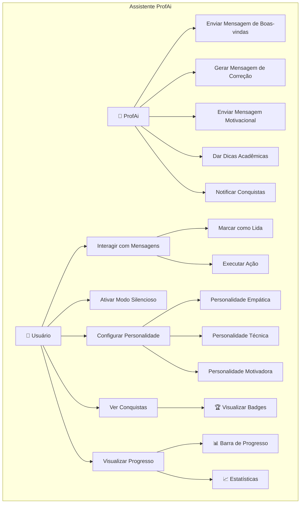
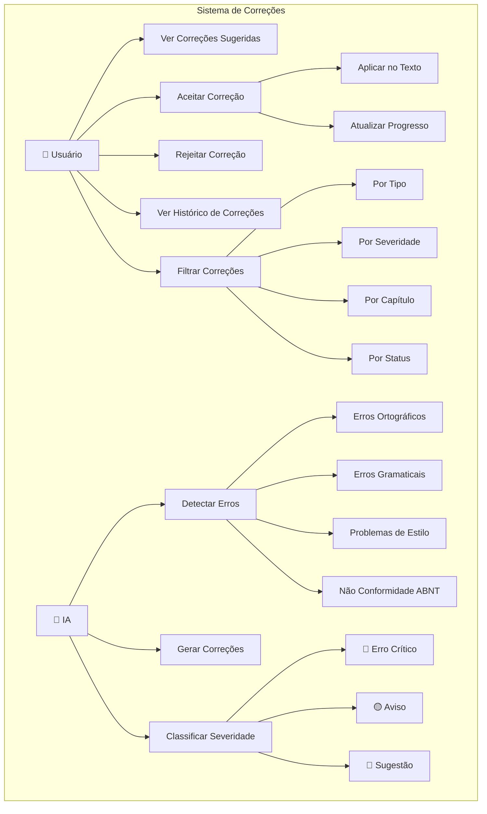
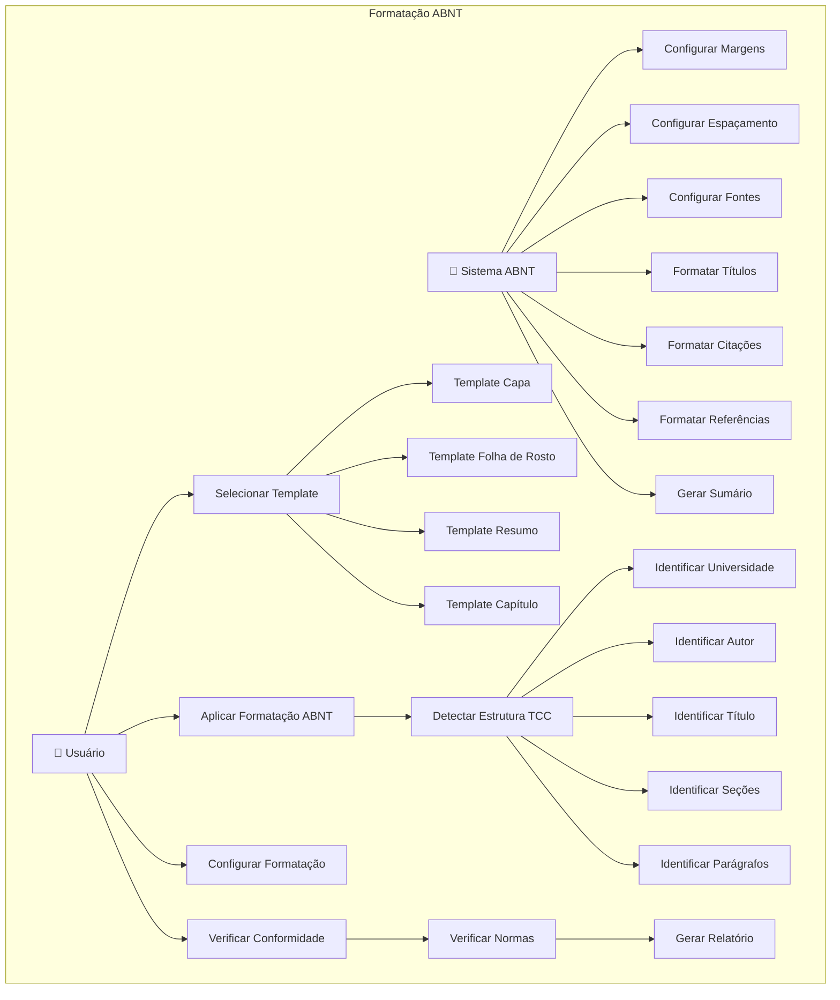
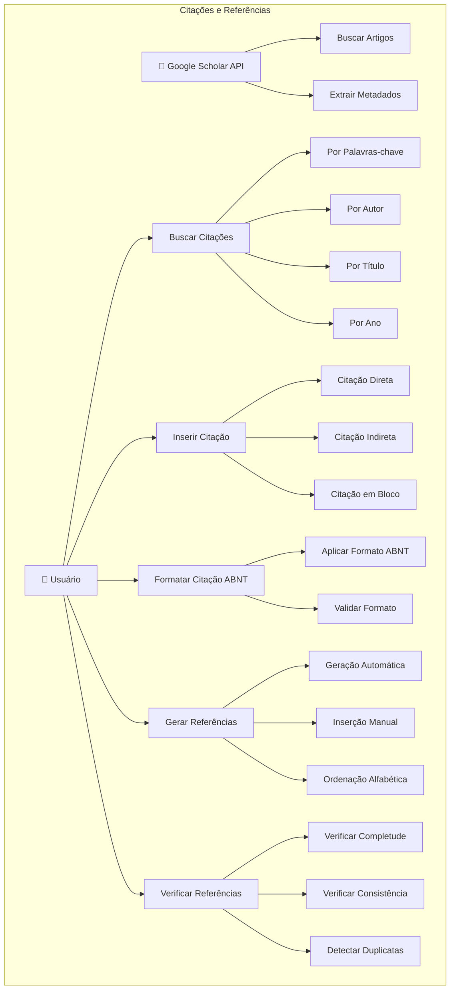
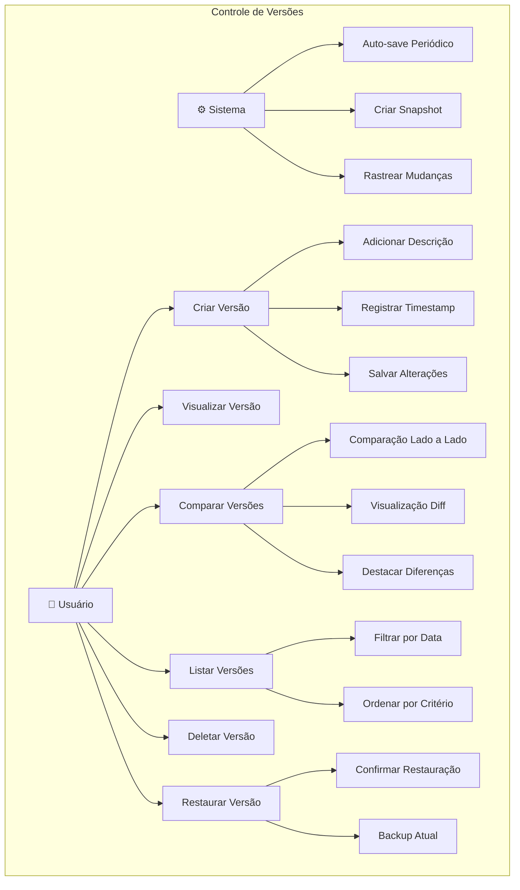
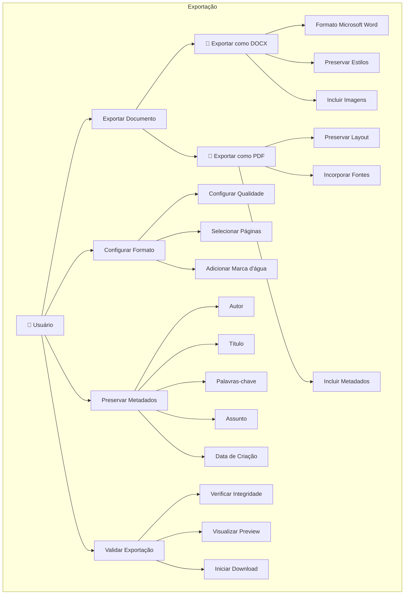

# 📚 Documentação do Sistema ProfAi TCC Editor

## 🎯 Visão Geral do Sistema

O **ProfAi TCC Editor** é uma plataforma inteligente de edição acadêmica que combina inteligência artificial com pedagogia para auxiliar estudantes na criação de trabalhos de conclusão de curso (TCC) de excelência. O sistema oferece correções em tempo real, formatação ABNT automática e uma assistente virtual personalizada.

---

## 🏗️ Arquitetura do Sistema

### Stack Tecnológica

**Frontend:**
- React 18 + TypeScript
- Vite (Build Tool)
- TailwindCSS (Estilização)
- React Quill (Editor de Texto)
- Framer Motion (Animações)
- React Router (Navegação)

**Backend:**
- Node.js + Express
- PostgreSQL (Banco de Dados)
- JWT (Autenticação)
- OAuth2/SSO (Integração UNIFOR)

**Infraestrutura:**
- Docker + Docker Compose
- Nginx (Proxy Reverso)
- SSL/TLS (Segurança)

---

## 📋 Diagramas de Caso de Uso por Funcionalidade

### 1. 🔐 **Gestão de Usuários e Autenticação**



**Atores:** Usuário, Sistema OAuth UNIFOR
**Casos de Uso:**
- UC001: Fazer Login via UNIFOR
- UC002: Registrar Nova Conta
- UC003: Gerenciar Perfil do Usuário
- UC004: Configurar Preferências do Sistema
- UC005: Logout Seguro

---

### 2. 📝 **Gestão de Documentos**



**Atores:** Usuário, Sistema de Arquivos
**Casos de Uso:**
- UC006: Criar Novo Documento TCC
- UC007: Upload de Arquivo (.docx/.pdf)
- UC008: Abrir Documento Existente
- UC009: Salvar Documento (Manual/Automático)
- UC010: Gerenciar Lista de Documentos

---

### 3. ✏️ **Editor de Texto Inteligente**



**Atores:** Usuário, IA de Análise de Texto
**Casos de Uso:**
- UC011: Editar Texto em Tempo Real
- UC012: Aplicar Formatação de Texto
- UC013: Alternar Modos de Visualização
- UC014: Usar Atalhos de Teclado
- UC015: Análise Inteligente de Texto

---

### 4. 🤖 **Assistente Virtual ProfAi**



**Atores:** Usuário, ProfAi (IA)
**Casos de Uso:**
- UC016: Interagir com Mensagens da ProfAi
- UC017: Configurar Personalidade da IA
- UC018: Ativar/Desativar Modo Silencioso
- UC019: Visualizar Conquistas e Progresso
- UC020: Receber Dicas Contextuais

---

### 5. 🔍 **Sistema de Correções**



**Atores:** Usuário, IA de Correção
**Casos de Uso:**
- UC021: Visualizar Correções Sugeridas
- UC022: Aceitar/Rejeitar Correções
- UC023: Filtrar Correções por Critério
- UC024: Ver Histórico de Correções
- UC025: Análise Automática de Texto

---

### 6. 📐 **Formatação ABNT Automática**



**Atores:** Usuário, Sistema de Formatação ABNT
**Casos de Uso:**
- UC026: Aplicar Formatação ABNT Automática
- UC027: Selecionar Template ABNT
- UC028: Configurar Parâmetros de Formatação
- UC029: Verificar Conformidade com Normas
- UC030: Gerar Elementos Automáticos (Sumário, etc.)

---

### 7. 📚 **Gestão de Citações e Referências**



**Atores:** Usuário, Google Scholar API
**Casos de Uso:**
- UC031: Buscar Citações no Google Scholar
- UC032: Inserir Citação no Texto
- UC033: Formatar Citação em ABNT
- UC034: Gerar Lista de Referências
- UC035: Verificar Consistência das Referências

---

### 8. 📊 **Controle de Versões e Histórico**



**Atores:** Usuário, Sistema de Versionamento
**Casos de Uso:**
- UC036: Criar Nova Versão do Documento
- UC037: Listar Versões Existentes
- UC038: Comparar Versões do Documento
- UC039: Restaurar Versão Anterior
- UC040: Gerenciar Histórico de Versões

---

### 9. 📤 **Exportação e Compartilhamento**



**Atores:** Usuário, Sistema de Exportação
**Casos de Uso:**
- UC041: Exportar Documento como DOCX
- UC042: Exportar Documento como PDF
- UC043: Configurar Opções de Exportação
- UC044: Preservar Metadados no Export
- UC045: Validar Documento Exportado

---

### 10. 🎮 **Sistema de Gamificação**

```mermaid
graph TB
    subgraph "Gamificação"
        U[👤 Usuário] --> VP[Ver Progresso]
        U --> UC[Desbloquear Conquistas]
        U --> VB[Ver Badges]
        U --> CE[Compartilhar Estatísticas]
        
        System[🎮 Sistema] --> TP[Calcular Progresso]
        System --> DA[Detectar Conquistas]
        System --> GM[Gerar Mensagens]
        System --> US[Atualizar Estatísticas]
        
        VP --> ProgressBar[📊 Barra de Progresso]
        VP --> Percentage[Porcentagem Completa]
        VP --> WordCount[Contagem de Palavras]
        VP --> TimeSpent[Tempo Gasto]
        
        UC --> FirstUpload[🏆 Primeiro Upload]
        UC --> FirstCorrection[✅ Primeira Correção]
        UC --> ChapterComplete[📚 Capítulo Completo]
        UC --> HalfWay[🎯 Meio Caminho (50%)]
        UC --> FullReview[🏅 Revisão Completa]
        UC --> ABNTMaster[📐 Mestre ABNT]
        UC --> SpeedWriter[⚡ Escritor Rápido]
        
        VB --> Earned[Badges Conquistadas]
        VB --> Progress[Progresso das Badges]
        VB --> Locked[Badges Bloqueadas]
        
        GM --> Motivational[Mensagens Motivacionais]
        GM --> Celebration[Mensagens de Celebração]
        GM --> Encouragement[Mensagens de Encorajamento]
    end
```

**Atores:** Usuário, Sistema de Gamificação
**Casos de Uso:**
- UC046: Visualizar Progresso da Revisão
- UC047: Desbloquear Conquistas
- UC048: Gerenciar Sistema de Badges
- UC049: Receber Mensagens Motivacionais
- UC050: Acompanhar Estatísticas de Uso

---

## 🔄 Fluxos Principais do Sistema

### Fluxo 1: Criação e Edição de TCC
```
1. Usuário faz login → 2. Cria novo documento → 3. Escreve/edita texto → 
4. IA analisa em tempo real → 5. Usuário aceita/rejeita correções → 
6. Aplica formatação ABNT → 7. Salva documento → 8. Exporta resultado final
```

### Fluxo 2: Upload e Revisão de Documento Existente
```
1. Usuário faz upload (.docx/.pdf) → 2. Sistema extrai texto → 
3. IA analisa documento completo → 4. Apresenta correções na sidebar → 
5. Usuário revisa correções → 6. Aplica formatação ABNT → 7. Exporta versão corrigida
```

### Fluxo 3: Interação com ProfAi
```
1. ProfAi envia mensagem de boas-vindas → 2. Usuário interage com editor → 
3. ProfAi detecta progresso → 4. Envia dicas contextuais → 
5. Usuário atinge marcos → 6. ProfAi celebra conquistas → 7. Motiva continuidade
```

---

## 📊 Métricas e KPIs do Sistema

### Métricas de Usuário
- **Taxa de Retenção**: % usuários que retornam após primeira sessão
- **Tempo Médio de Sessão**: Duração média de uso do editor
- **Documentos por Usuário**: Quantidade média de TCCs por usuário
- **Taxa de Conclusão**: % de documentos finalizados vs iniciados

### Métricas de Qualidade
- **Precisão das Correções**: % de correções aceitas vs sugeridas
- **Cobertura ABNT**: % de conformidade com normas após formatação
- **Satisfação do Usuário**: Score baseado em feedback e avaliações
- **Redução de Erros**: % de melhoria na qualidade textual

### Métricas de Engajamento
- **Interações com ProfAi**: Número médio de mensagens por sessão
- **Conquistas Desbloqueadas**: % de usuários que atingem marcos
- **Uso de Funcionalidades**: Frequência de uso de cada feature
- **Feedback Positivo**: % de avaliações positivas da IA

---

## 🔒 Considerações de Segurança

### Autenticação e Autorização
- **OAuth2/SSO** integrado com sistema UNIFOR
- **JWT Tokens** com expiração configurável
- **Rate Limiting** para prevenir abuso de APIs
- **Validação de entrada** em todas as rotas

### Proteção de Dados
- **Criptografia** de dados sensíveis em trânsito e repouso
- **Sanitização** de conteúdo para prevenir XSS
- **Backup automático** de documentos dos usuários
- **Conformidade LGPD** para proteção de dados pessoais

### Monitoramento
- **Logs de auditoria** para todas as ações críticas
- **Monitoramento de performance** e disponibilidade
- **Alertas automáticos** para comportamentos suspeitos
- **Análise de vulnerabilidades** periódica

---

## 🚀 Roadmap de Desenvolvimento

### Fase 1 - MVP (Concluída) ✅
- ✅ Editor de texto básico com React Quill
- ✅ Sistema de correções com IA
- ✅ Formatação ABNT automática
- ✅ ProfAi com personalidade adaptativa
- ✅ Sistema de gamificação básico
- ✅ Export para DOCX/PDF

### Fase 2 - Melhorias (Em Desenvolvimento) 🔄
- 🔄 Integração com Google Scholar API
- 🔄 Sistema de templates ABNT avançados
- 🔄 Controle de versões robusto
- 🔄 Análise de plágio básica
- 🔄 Colaboração em tempo real

### Fase 3 - Expansão (Planejada) 📋
- 📋 Integração com calendário UNIFOR
- 📋 Sistema de orientação virtual
- 📋 Análise de coerência e coesão avançada
- 📋 Suporte a múltiplos idiomas
- 📋 API pública para integrações

### Fase 4 - Inovação (Futuro) 🔮
- 🔮 IA generativa para sugestões de conteúdo
- 🔮 Análise de sentimento do texto
- 🔮 Integração com bases de dados acadêmicas
- 🔮 Sistema de peer review automatizado
- 🔮 Realidade aumentada para visualização 3D

---

## 📞 Suporte e Manutenção

### Canais de Suporte
- **Email**: suporte@profai.unifor.br
- **Chat Online**: Disponível 24/7 no sistema
- **FAQ**: Base de conhecimento integrada
- **Tutoriais**: Vídeos e guias passo a passo

### Manutenção Preventiva
- **Backups diários** automáticos
- **Atualizações de segurança** mensais
- **Monitoramento contínuo** de performance
- **Testes automatizados** em pipeline CI/CD

### SLA (Service Level Agreement)
- **Disponibilidade**: 99.9% uptime garantido
- **Tempo de Resposta**: < 2 segundos para operações básicas
- **Suporte**: Resposta em até 4 horas úteis
- **Recuperação**: RTO < 1 hora, RPO < 15 minutos

---

*Documentação gerada automaticamente em: ${new Date().toLocaleDateString('pt-BR')}*
*Versão do Sistema: 1.0.0*
*Última Atualização: ${new Date().toLocaleDateString('pt-BR')}*
